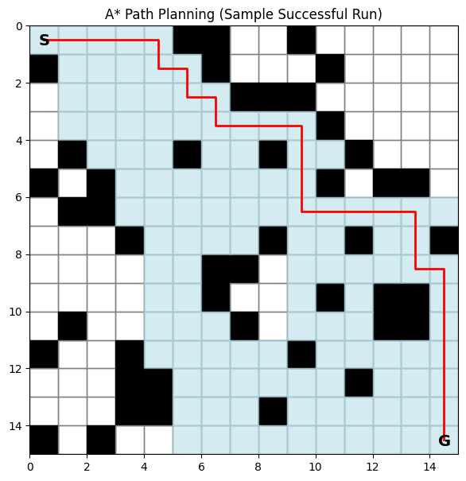

# Classical Path Planning using A*

## 📌 Overview
This module implements the A* (A-star) algorithm for solving grid-based path planning problems.

The goal is to find the shortest path from a start point to a goal while avoiding obstacles.

---

## ⚙️ Algorithm Explanation

A* is a best-first search algorithm that uses:

- **g(n):** Cost from start to current node  
- **h(n):** Heuristic (Manhattan distance)  
- **f(n) = g(n) + h(n)**

The algorithm always explores the node with the lowest f(n).

---

## 🧠 Key Features

- Grid-based environment
- Random obstacle generation
- Efficient shortest path search
- Tracks explored nodes
- Logs performance metrics

---

## 📊 Output Metrics

- Success / Failure
- Path length
- Number of explored nodes

---

## 📈 Visualization

The algorithm generates a visualization showing:

- Black cells → Obstacles  
- Blue cells → Explored nodes  
- Red line → Final path  
- S → Start  
- G → Goal  



---

## ▶️ How to Run

```bash
python astar.py
