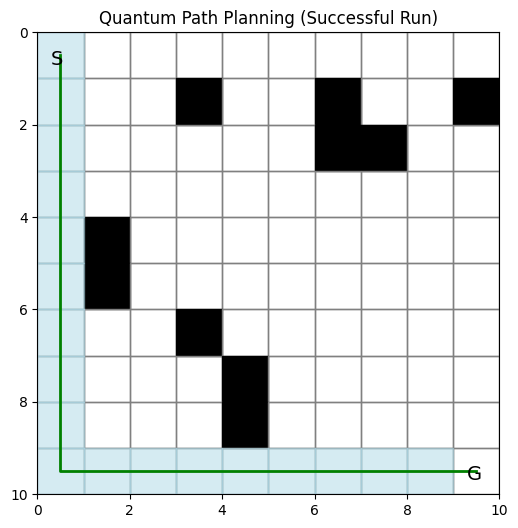

# Quantum-Inspired Path Planning

## 📌 Overview
This module implements a **quantum-inspired approach** for solving a grid-based path planning problem.

Unlike the classical A* algorithm, which deterministically finds the shortest path, this approach introduces **probabilistic decision-making** using a simple quantum circuit.

The goal is to explore how quantum concepts can influence decision-making in path planning.

---

## 🧠 Core Idea

- The grid environment and movement logic are still classical.
- At each step, the algorithm selects the best possible moves based on distance to the goal.
- If multiple equally good moves exist:
  → A **quantum circuit** is used to decide between them.

This makes the algorithm:
- Probabilistic
- Non-deterministic
- Less optimal than A*, but conceptually interesting

---

## ⚛️ Inspiration from Grover’s Algorithm

This implementation is **inspired by Grover’s algorithm**, but does NOT implement it fully.

### 🔹 What is Grover’s Algorithm?
Grover’s algorithm is used for searching an unsorted database efficiently.

It works using:
- Superposition (trying multiple possibilities at once)
- Phase marking (highlighting correct states)
- Amplitude amplification (increasing probability of correct answers)

---

### 🔹 How it is used here

In this project:

- A small 2-qubit circuit is created
- Uses:
  - Hadamard gates → superposition  
  - Controlled-Z gate → phase interaction  
  - Measurement → probabilistic output  

Instead of searching, it is used as a **decision-making tool**.

---

### 🔹 Important Note

This is:
- A Grover-inspired decision mechanism  
- NOT a full Grover search implementation  

---

## ⚙️ Code Explanation

### 1. Parameters

- GRID_SIZE → size of grid  
- OBSTACLE_PROB → obstacle density  
- NUM_RUNS → number of experiments  
- START, GOAL → positions  

---

### 2. Quantum Circuit

Function: grover_direction()

- Creates 2-qubit circuit
- Applies superposition and interference
- Measures output

Output:
- "00", "01", "10", or "11"

This acts like a quantum-based random selector.

---

### 3. Move Selection

Function: quantum_move()

- Finds valid moves
- Chooses moves closest to goal
- If multiple best moves:
  → uses quantum circuit

---

### 4. Path Planning

Function: quantum_path()

- Starts from initial node
- Moves step by step
- Avoids revisiting nodes
- Stops when goal reached or limit exceeded

---

### 5. Experiment Loop

- Runs multiple simulations
- Generates random obstacles
- Stores results

---

### 6. Logging

Logs are saved in:

    quantum_path_logs.json

Includes:
- Success
- Path length
- Explored nodes

---

### 7. Visualization

Shows:

- Black → Obstacles  
- Blue → Explored nodes  
- Green → Path  
- S → Start  
- G → Goal  

---

## 📈 Sample Output

---

## 📊 Observations

- Lower success rate than A*
- No guarantee of shortest path
- Can get stuck due to randomness

---

## ⚖️ Comparison with A*

| Feature | A* | Quantum |
|--------|----|--------|
| Type | Deterministic | Probabilistic |
| Optimal Path | Yes | Not guaranteed |
| Decision | Global | Local |
| Reliability | High | Lower |

---

## ▶️ How to Run

Install dependencies:

    pip install numpy matplotlib qiskit qiskit-aer

Run the program:

    python quantum_path.py

---

## 📌 Conclusion

This module demonstrates how quantum concepts can influence classical algorithms.

It provides insight into:
- Hybrid classical-quantum systems
- Probabilistic decision-making
- Practical use of quantum circuits
